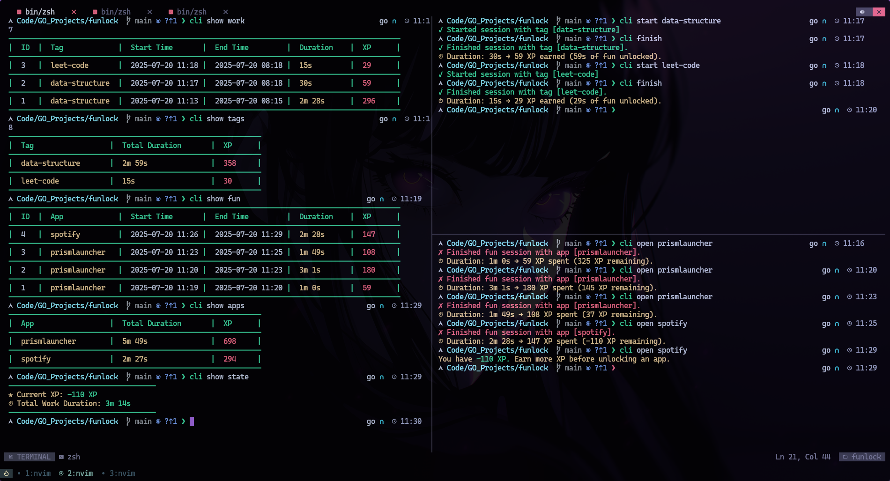

# 🔐 Funtool

**Funtool** is a productivity-first tool that locks your fun apps until you've earned enough XP through work sessions.

If your XP is **0 or negative**, you won't be able to launch your fun apps. You'll need to **start a work session**, earn XP, and then enjoy your favorite tools and games.

Currently, **Funtool supports Linux only.**

---

## 📸 Preview



---

## 📦 Installation

Build the CLI binary and place it somewhere in your `$PATH`.

```bash
go build -o funlock .
sudo mv funlock /usr/local/bin/
```

---

## 🚀 Usage

### ✅ Start a Work Session

```bash
funlock start <tag>
```

Start tracking a focused work session. The `tag` is a short description of what you're working on.

Examples:

```bash
funlock start data-structure
funlock start leet-code
```

---

### 🛑 Finish a Work Session

```bash
funlock finish
```

Ends the currently running work session and adds earned XP based on the time worked.

---

### 📊 Show Stats & Logs

```bash
funlock show <section> [count]
```

- `count` is optional (default is `10`).
- `section` must be one of: `work`, `fun`, `state`, `tags`, `apps` or `stats`.

#### Examples:

```bash
funlock show work
```
→ Shows your latest 10 work sessions.

```bash
funlock show fun
```
→ Shows your latest 10 fun sessions.

```bash
funlock show state
```
→ Shows your current XP and total work time.

```bash
funlock show tags
```
→ Shows top 10 tags sorted by total work time.

```bash
funlock show apps
```
→ Shows top 10 apps used in fun sessions, sorted by total usage time.

```bash
funlock show stats
```
→ Shows the total work duration for each day of the current week.

---

### 🎮 Open a Fun App (If You Have Enough XP)

```bash
funlock open <command>
```

Attempts to launch the app wrapped by `<command>`. If you have enough XP, the app will launch, and a fun session will start. Once you close the app, the session ends and XP is deducted.

Example:

```bash
funlock open spotify
```

---

## 🔒 How to Lock Your Apps

To fully integrate Funtool into your workflow, you'll need to route your fun apps through it.

### 🖥️ For CLI Apps

Create a shell alias:

```bash
alias <cmd>="funlock open <cmd>"
```

Example:

```bash
alias spotify="funlock open spotify"
```

Add it to your `~/.bashrc` or `~/.zshrc`.

---

### 🧩 For GUI Apps (App Launchers / Desktop Icons)

1. Copy the app's `.desktop` file to your local directory:

```bash
cp /usr/share/applications/<app>.desktop ~/.local/share/applications/
```

2. Edit the file and modify the `Exec` line:

**Before:**
```
Exec=spotify
```

**After:**
```
Exec=funlock open --notify spotify
```
Save the file. Now launching the app from the menu will be blocked unless you have XP.

> **Optional:** Add `--notify` if you want to receive a desktop notification when the app is blocked due to insufficient XP.

---

## 📎 Notes

- XP is gained from work sessions and spent on fun apps.
- You can’t open fun apps unless your XP is positive.
- Everything is tracked locally in a SQLite database.

---

## 🧪 Status

✅ Linux support  
📁 Local database: SQLite  
📚 Session tracking: Work + Fun  

---

## 📄 License

MIT — do what you want responsibly. See [LICENSE](./LICENSE) for details.
